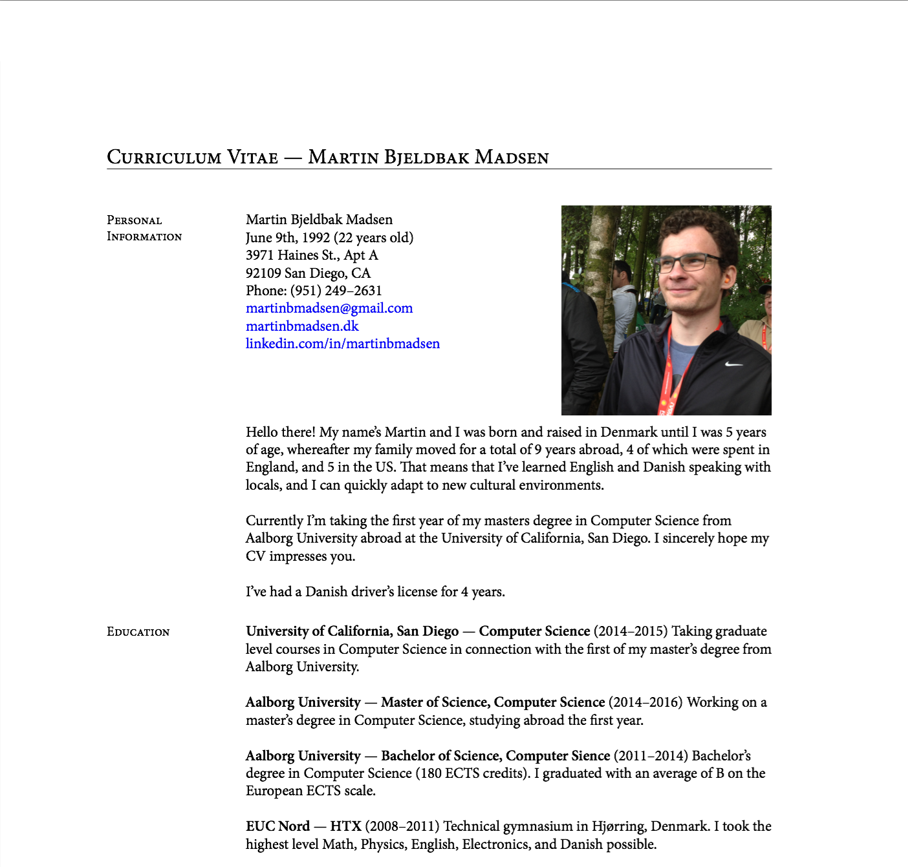

# Martin Madsens's CV

My CV, heavily inspired from [Thomas Jansson](http://www.tjansson.dk/?p=604)'s layout using the [resume.cls](http://people.debian.org/~dburrows/resume-cls.html) class. It uses XeTeX and fontspec to use the Minion Pro font type.

It's very messy, something I plan on working on! Maybe by creating a custom CV class or by using/modifying [afriggeri](https://github.com/afriggeri/cv)'s.
